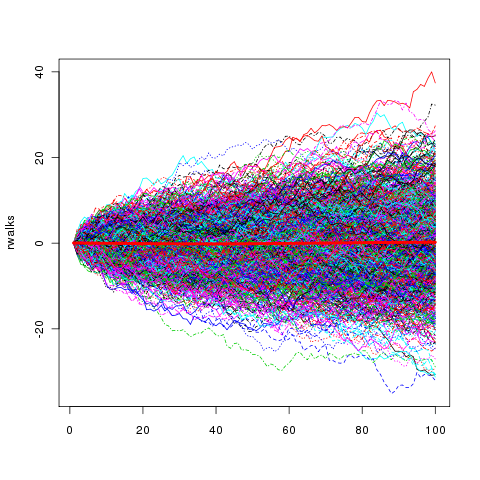

Imagine that we have a person that starts from origin (0),  and will either go forward $p$ or backward $1-p$ based on a random probability. The walk is random in the sense that the future direction the person moves is random, and completely independent of anything in the present or past. Any previous actions say nothing about the next action. A random walk is not *non-stationary* because it isn't constant in mean, as is evident by our calculations. A \textbf{random walk is non-stationary time-series because its variance and covariance are a function of time. The mean is in fact constant}.

### Why AR(1) with $\varphi = 1$
Given the formal equation for AR(1)...
$$y_t = \mu + \varphi y_{t-1} + \varepsilon_t$$
Now imagine that $\mu$ is 0 (that's always the case with time series), and $\varepsilon = 1$. Since the condition is $|\varphi| = 1$. We would end up with the exact formula for random walk:
$$y_t = y_{t-1} + \varepsilon_t$$
This implies that \textbf{The best prediciton of y for the next prediction is the current value of y}. The mean is constant but the variance is not! It's a random process in the sense that there is really nothing the past is able to tell us about which way the outcome variable may go. 

### Why ARIMA(0, 1, 0) is a Random Walk
It is a cumulative sum of an i.i.d. process which itself is known as ARIMA(0,0,0).

### Why Random Walk is not White Noise
No. For random walks, $Var(x_{t+1}) = Var(x_t) + Var(\varepsilon_{t+1})$ is strictly increasing. With random noise, noise is constant.

### Why Variance of Random Walk Increases over Time
The random walk can be defined as $Y_{t} = Y_{t-1} + e_t$ where $e_t$ is white noise. Because it keeps adding the variance of the next increments to the variability we have in getting to where we are now. Let's simplify it with an example. We can Flip a coin in the following ways.
$$e_i = \left\{ \begin{array}{c} 1 \ \text{with} \ Pr = .5 \\ -1 \ \text{with} \ Pr = .5 \end{array} \right.$$
Now, suppose you have gathered an army of coin flippers. Their instructions are to, at your command, flip their coin, and keep a working tally of what their results were, along with a summation of all their previous results. Each individual flipper is an instance of the random walk. and aggregating over all of your army should give you a take on the expected behavior. The result may look something like this.

#### Flip 1
About half of your army flips heads, and half flips tails. The expectation of the sum, taken across your whole army, is zero. The maximum value of 𝑊 across your whole army is 1 and the minimum is −1, so the total range is 2.
#### Flip 2
About half flip heads, and half flips tails. The expectation of this flip is again zero, so the expectation of 𝑊 over all flips does not change. Some of your army has flipped 𝐻𝐻, and some others have flipped 𝑇𝑇, so the maximum of 𝑊 is 2 and the minimum is −2; the total range is 4.
#### Flip n
About half flip heads, and half flips tails. The expectation of this flip is again zero, so the expectation of 𝑊 over all flips does not change, it is still zero. If your army is very large, some very lucky soldiers flipped 𝐻𝐻⋯𝐻 and others 𝑇𝑇⋯𝑇. That is, there is a few with 𝑛 heads, and a few with 𝑛 tails (though this is getting rarer and rarer as time goes on). So, at least in our imaginations, the total range is 2𝑛.

#### Hence...
So here's what you can see from this thought experiment:
* The expectation of the walk is zero, as each step in the walk is balanced.
* The total range of the walk grows linearly with the length of the walk.
To recover intuition we had to discard the standard deviation and use in intuitive measure, the range.

### Random Walk With Drift
Despite random walk being non-stationary, it retains the characteristic of having a constant mean. However, there is the possibility of random walk in a time series with a trend. In this case, drift helps to deal with that by adding a constant coefficient.

$$X_t = a + X_{t-1} + \varepsilon_t$$

